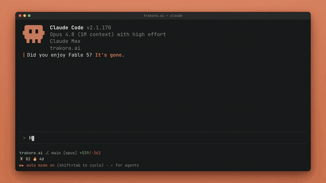

# Workout Gate 🏋️

> Ton prompt est bloqué tant que tu n'as pas fait ton exercice devant la webcam.

<p align="center">
  
</p>

Workout Gate prend tes prompts Claude Code et Codex en otage derrière un
défi physique : pompes ou squats, comptés en direct à la webcam. Quand un défi
tombe, tu choisis ta douleur (genre 6 pompes *ou* 9 squats). Pas d'effort, pas
de prompt. Tu fermes la session pour esquiver ? La dette t'attend à la suivante.

*English version: [README.md](README.md) · par [@Botchet](https://x.com/Botchet)*

## Prérequis

- **Python 3.9–3.13** — y compris le Python 3.9 système de macOS, donc aucun Python plus récent à installer.
- Une **webcam** + une connexion internet (le 1er lancement télécharge MediaPipe/OpenCV et un modèle de pose ~9 Mo).
- **macOS** pour l'onboarding plugin zéro-config — il ouvre le setup dans un Terminal et déclenche le dialogue de permission caméra. Linux/Windows marchent aussi ; Claude te pointe juste vers `bootstrap.sh` à lancer une fois à la main.
- `git` et `python3` dans le PATH.

## Installation

### En plugin Claude Code (CLI + desktop, recommandé)

```
/plugin marketplace add BotchetDig/workout-gate
/plugin install workout-gate@workout-gate
```

Puis **démarre une nouvelle session** (ou lance `/reload-plugins`) — rien ne
se passe avant ça. Le plugin marche dans Claude Code CLI et desktop.
L'onboarding s'ouvre tout seul dans une fenêtre Terminal — installation des
dépendances, puis l'assistant de 30 secondes (ton max, choix du déclencheur,
test caméra de 2 pompes). Tant que le setup n'est pas fait, les prompts passent
librement. Le gate et `/workout-gate:workout` marchent ensuite dans toutes tes
sessions, et les mises à jour du plugin ne cassent jamais l'installation (le
runtime vit dans `~/.workout-gate/`).

### Marche aussi dans Codex (CLI + desktop)

Le gate utilise le même hook `UserPromptSubmit` dans **Codex** — CLI et desktop.
Depuis Codex, ouvre `/plugins`, ajoute la marketplace `BotchetDig/workout-gate`
si besoin, puis installe `workout-gate`. Codex affiche la validation des hooks à
part, donc approuve les hooks du plugin une fois avec `/hooks` avant de tester
un prompt.

Tu préfères les commandes terminal ? Après le setup, branche-le sur toutes tes
sessions Codex :

```bash
workout codex on     # ajoute le hook à ~/.codex/hooks.json
workout codex off    # le retire
```

Si `workout` n'est pas encore dans ton PATH, utilise le launcher installé :

```bash
~/.workout-gate/app/workout codex on
```

Attention : `workout global on` branche à la fois Claude Code *et* Codex s'il
voit `~/.codex`, parce que tu gates ton usage d'IA, pas un outil en
particulier. Validé sur les quatre surfaces — Claude Code CLI et desktop, Codex
CLI et desktop.

Tout est **partagé entre les outils** : un seul runtime dans `~/.workout-gate/`
contient ta dette, ton compteur de prompts, tes stats et ta série. Esquive un
défi dans Claude Code et la dette bloque ton prochain prompt Codex. Deux prompts
simultanés ne peuvent pas double-déclencher (le compteur est verrouillé) ni
ouvrir deux fenêtres webcam à la fois (un défi déjà en cours ailleurs laisse
simplement passer l'autre prompt). Sur les flows desktop macOS qui lancent des
hooks sans vrai terminal, le défi s'ouvre dans une fenêtre Terminal pour que la
permission caméra soit attribuée à Terminal — force l'un ou l'autre avec
`WORKOUT_GATE_TERMINAL=1` / `0`.

### Une ligne, sans le plugin

```bash
curl -fsSL https://raw.githubusercontent.com/BotchetDig/workout-gate/main/get.sh | bash
```

Relancer la même ligne met à jour. Tu préfères inspecter d'abord ?

```bash
git clone https://github.com/BotchetDig/workout-gate.git && cd workout-gate
./install.sh
```

L'installeur prépare tout (venv, dépendances, modèle de pose) puis te guide
dans un assistant de 30 secondes : il demande ton max en une série pour
calibrer les défis sur toi (25–50 % du max), te fait choisir le déclencheur,
propose l'installation globale, et lance un test caméra de 2 pompes pour que
le dialogue de permission macOS arrive maintenant — pas au milieu de ton
premier prompt bloqué.

Relance l'assistant quand tu veux avec `workout setup`. `./install.sh
--no-setup` pour une installation non interactive avec les défauts (tous les
15 prompts, 5–10 reps).

## Usage

Pilote-le avec `! workout` depuis Claude Code (le préfixe `!` lance une
commande shell — instantané, **zéro token**), ou juste `workout` depuis
n'importe quel terminal. Codex CLI n'a pas le raccourci shell `!` de Claude :
utilise un terminal pour les réglages comme `workout on`, `workout off` et
`workout status`.

| Commande | Effet |
|---|---|
| `! workout` | ouvre le dashboard web (réglages + stats live) dans ton navigateur |
| `! workout tui` | le dashboard terminal à la place (curses, flèches) |
| `! workout now` | forcer un défi tout de suite (parfait pour filmer) |
| `! workout stats` | totaux par exercice + histo 7 jours (flèches pour changer d'exo dans un vrai terminal) |
| `! workout status` | état du gate (compteur, dette, réglages) |
| `! workout on` / `off` | activer / désactiver |
| `! workout stop` | fermer un défi en cours |
| `! workout preset chill\|demo\|hardcore` | voir presets ci-dessous |
| `! workout enable\|disable squats` | activer/désactiver un exercice |
| `! workout set reps squats 8 15` | fourchette d'un exercice |
| `! workout set mode choice\|random` | choisir l'exo soi-même, ou au hasard |
| `! workout debug on\|off` | affiche le squelette détecté + l'angle en direct (utile pour ajouter des exos) |
| `! workout set freq 15` | un défi tous les 15 prompts |
| `! workout set time 30` | temporel : au plus un défi toutes les 30 min |
| `! workout set chance 10` | roulette : 10 % de chance à chaque prompt |

> Une slash command `/workout-gate:workout` existe aussi, mais elle passe par
> Claude et consomme des tokens — préfère `! workout` pour tout ce qui précède.

### Dashboard

`! workout` (ou `workout` dans un terminal) ouvre le **dashboard web** dans ton
navigateur. Il est en **onglets** : un onglet **Overview** (tous les réglages —
preset, déclencheur, gate on/off — et les stats combinées) et **un onglet par
exercice**, chacun avec son interrupteur, sa fourchette de reps, ses compteurs
jour/total et son histo 7 jours. Ajoute un exercice (une entrée dans
`detector.py`) et son onglet apparaît tout seul. Le bouton « forcer un défi »
est à un clic. C'est un mini serveur **100 % local** (stdlib, zéro dépendance,
sur `127.0.0.1`) qui s'éteint quelques minutes après la fermeture de l'onglet.

Tu préfères le terminal ? `! workout tui` ouvre le dashboard **réglages** curses
(flèches pour naviguer, gauche/droite pour changer les valeurs), et
`! workout stats` est le visualiseur de **stats** dédié (←/→ pour parcourir TOUT
+ chaque exercice : total, série, record, histo 7 jours). Les deux s'ouvrent
dans une fenêtre Terminal sur macOS ; le défi webcam, lui, est inchangé partout.

### Presets

- **chill** — tous les 25 prompts, 3–6 reps. Usage quotidien.
- **demo** — à chaque prompt, 5–8 reps. Mode tournage.
- **hardcore** — tous les 5 prompts, 15–25 reps. Tu l'as voulu.

## Comment ça marche

- Un hook `UserPromptSubmit` compte tes prompts. Quand un défi tombe, il tire
  un nombre de pompes, **persiste la dette sur disque d'abord**, ouvre la
  fenêtre webcam et gèle ton prompt jusqu'à validation. Puis le prompt part
  tout seul.
- Détection : MediaPipe Pose. Pompes via l'angle du coude (**de profil, au
  sol**, corps horizontal) ; squats via l'angle du genou (**debout, plein
  cadre, de côté**, corps vertical). Une rep = descente complète puis
  extension, avec lissage et garde-fou anti-triche.
- Quand plusieurs exercices sont actifs, le défi propose un choix (« choisis
  ta douleur ») — ou tire au hasard en `mode random`.
- La fenêtre du défi nomme qui paie sur le moment — **CLAUDE** ou **CODEX** —
  même voix de coach, juste le nom qui change.
- Chaque rep est écrite sur disque à l'instant où elle est faite (écriture
  atomique) : tu coupes à 4/8, tu gardes 4 aux stats et il t'en reste 4 dues.
- **Bloquant par défaut** : un défi abandonné gèle ton prompt tant que tu n'as
  pas fini (renvoie pour réessayer). Bascule *Challenge mode* sur non-bloquant
  dans le dashboard et la webcam compte toujours tes reps, mais fermer la
  fenêtre laisse toujours passer le prompt.
- Données dans `~/.workout-gate/` : `config.json`, `state.json`, `stats.json`,
  `gate.log`.

## Portes de sortie (anti-lockout, par design)

1. `workout off` depuis n'importe quel terminal — l'interrupteur universel
   (marche quel que soit l'outil).
2. Les prompts qui pilotent le gate ne sont jamais bloqués, tu peux donc
   toujours y accéder : `/workout ...` dans Claude Code, ou les formes brutes
   `workout ...` / `wg ...` dans Codex CLI. Elles peuvent quand même consommer
   un tour modèle dans Codex ; utilise un terminal pour du contrôle zéro token.
3. `WORKOUT_GATE_OFF=1` dans l'environnement court-circuite tout.
4. Un défi déjà en cours dans un autre outil/session → ce prompt passe en
   fail-open (pas de deuxième fenêtre webcam).
5. **Fail-open** : pas de webcam, dépendance cassée, crash → le prompt passe et
   l'erreur va dans `~/.workout-gate/gate.log`. Jamais enfermé hors de ton
   propre outil.

## Installation globale

Par défaut le gate ne s'applique que dans ce dossier. Pour gater **toutes** tes
sessions Claude Code (l'install plugin le fait pour toi) :

```bash
./install.sh --global        # ou : workout global on
workout global off           # pour retirer
```

Ça ajoute chirurgicalement une entrée de hook dans `~/.claude/settings.json`
(une sauvegarde de ton fichier d'origine est gardée à côté) et retire
exactement ça au `off`. Effectif dans les nouvelles sessions.

Pour Codex CLI sans passer par le plugin :

```bash
workout codex on
workout codex off
```

Puis approuve le hook une fois avec `/hooks` dans une nouvelle session Codex CLI.

## Tests

```bash
.venv/bin/python -m unittest discover -s tests
```

## Segment de statusline (optionnel)

Affiche tes reps directement dans la statusline de Claude Code. `workout
statusline` imprime un segment compact auto-coloré — `🏋 36 🔥4d` (reps du
jour + série).

Claude Code n'a qu'une seule commande de statusline (`statusLine` dans
`settings.json`). Si tu as déjà un script de statusline, ajoute le segment à
sa sortie :

```sh
# vers la fin de ton script, avant le printf final
WG="$HOME/.local/bin/workout"
[ -x "$WG" ] && wg=$("$WG" statusline 2>/dev/null)
# ...puis ajoute  ${wg:+ $wg}  à ton printf
```

Ou, pour une statusline qui n'est *que* le segment workout, dans
`settings.json` :

```json
"statusLine": { "type": "command", "command": "workout statusline" }
```

## Ajouter ton propre exercice (fork)

Tout passe par un seul registre, `detector.EXERCISES`. Ajouter un exo = deux
étapes dans `workout_gate/detector.py`, rien d'autre :

1. **Un compteur** — hérite de `ExerciseCounter`, déclare l'angle articulaire
   suivi et les seuils bas/haut (surcharge `posture()` pour rejeter une
   mauvaise posture) :

   ```python
   class SitupCounter(ExerciseCounter):
       SIDES = ((L_HIP, L_SHOULDER, L_KNEE), (R_HIP, R_SHOULDER, R_KNEE))
       DOWN_ANGLE = 55.0
       UP_ANGLE = 110.0
   ```

2. **Une entrée dans le registre** :

   ```python
   "situps": {
       "label": "SIT-UPS", "counter": SitupCounter,
       "cue": "LIE DOWN - SIDE-ON",
       "default_reps": (8, 15), "default_max": 30,
   },
   ```

Config par défaut, presets, assistant d'install, dashboard, écran de choix et
stats par exercice lisent tous le registre — ils le prennent en compte
automatiquement. `test_factory.py` prouve qu'une nouvelle entrée se propage de
bout en bout.

---

Fait par **[@Botchet](https://x.com/Botchet)**. Si Workout Gate t'a fait
transpirer, un follow fait plaisir. 🏋️
